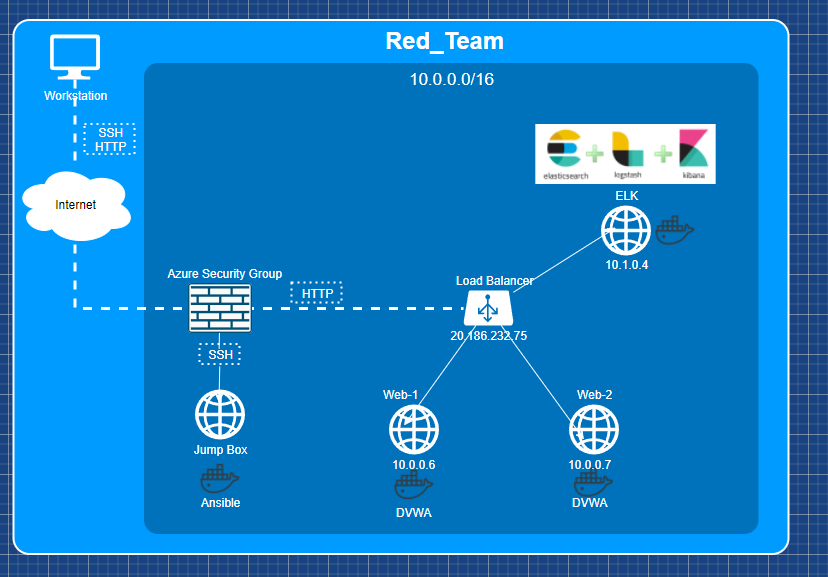
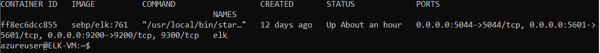

## Automated ELK Stack Deployment

The files in this repository were used to configure the network depicted below.

These files have been tested and used to generate a live ELK deployment on Azure. They can be used to either recreate the entire deployment pictured above. Alternatively, select portions of the .yml file may be used to install only certain pieces of it, such as Filebeat.

  [filebeat-playbook.yml](ansible/roles/filebeat-playbook.yml)

This document contains the following details:
- Description of the Topology
- Access Policies
- ELK Configuration
  - Beats in Use
  - Machines Being Monitored
- How to Use the Ansible Build

### Description of the Topology

The main purpose of this network is to expose a load-balanced and monitored instance of DVWA, the D*mn Vulnerable Web Application.

Load balancing ensures that the application will be highly reliable, in addition to restricting disruption (ie. DDoS attacks) to the network.

Integrating an ELK server allows users to easily monitor the vulnerable VMs. Filebeat ships logs and events into the ELK stack, and this data is displayed graphically. Metricbeat periodically collects metrics from the operating system such as CPU/memory and any date from running services. 

The configuration details of each machine may be found below.

| Name     | Function     | IP Address    | Operating System |
|----------|--------------|---------------|------------------|
| Jump Box | Gateway      | 137.135.26.68 | Linux            |
| Web-1    | Web Sever    | 10.0.0.6      | Linux            |
| Web-2    | Web Sever    | 10.0.0.7      | Linux            |
| ELK      | Log Analysis | 10.1.0.4      | Linux            |

### Access Policies

The machines on the internal network are not exposed to the public Internet. 

Only the jumpbox machine can accept connections from the Internet.

Machines within the network can only be accessed by ansible.

### Elk Configuration

Ansible was used to automate configuration of the ELK machine. No configuration was performed manually, which is advantageous because it provides a simple and powerful package for configuration management and automation. 
The playbook implements the following tasks:
- install docker
- install python
- download and install image
- launch container
- enable docker on boot

The following screenshot displays the result of running `docker ps` after successfully configuring the ELK instance.

### Target Machines & Beats
This ELK server is configured to monitor the following machines: Web-1 (10.0.0.6) and Web2 (10.0.0.7)

We have installed the following Beats on these machines: Filebeat and Metricbeat

These Beats allow us to collect the following information from each machine:
Data about the filesystem and machine metrics, like uptime.

### Using the Playbook
In order to use the playbook, you will need to have an Ansible control node already configured. Assuming you have such a control node provisioned: 

SSH into the control node and follow the steps below:
- Copy the install-web.yml file to /etc/ansible/
- Update the host file. Add the internal IP address of your web servers under the object [webservers] with the extension "ansible_python_interpreter=/usr/bin/python3"
- Run the playbook, and navigate to http://http://[your-ip]:5601/app/kibana to check that the installation worked as expected.
